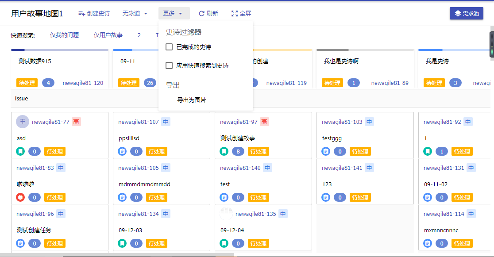

# 导出图片

## 功能
  
如图1，点击"更多",弹出popOver，点击"导出为图片",popOver隐藏，并提示导出图片成功，下载图片

## 几个注意点  
1. 请注意导出图片的宽度和高度，默认以可见区域导出，但是应考虑水平滚动条和垂直滚动条区域  
2. 注意到处图片的清晰度  
3. 下载时指定图片的名字  

## 思路  
使用`html2Canvas`将Dom转换为canvas，再下载

## 代码实现

        import html2canvas from 'html2canvas';

         handleSaveAsImage = () => {
            this.setState({
            popOverVisible: false,
            });
            const shareContent = document.querySelector('.fixHead');// 需要截图的包裹的（原生的）DOM 对象，注意，默认情况下shareContent的width、height不包含滚动条部分，因此需要设置width、height，这样导出的图片才完整
            shareContent.style.width = `${Math.max(document.querySelector('.fixHead-head').scrollWidth, document.querySelector('.fixHead-body').scrollWidth)}px`;
            shareContent.style.height = `${document.querySelector('.fixHead-head').scrollHeight + document.querySelector('.fixHead-body').scrollHeight}px`;

            const scaleBy = 2;
            const canvas = document.createElement('canvas');
            canvas.style.width = `${_.parseInt(_.trim(shareContent.style.width, 'px')) * scaleBy}px`;
            canvas.style.height = `${_.parseInt(_.trim(shareContent.style.height, 'px')) * scaleBy}px`;
            const context = canvas.getContext('2d');
            context.scale(scaleBy, scaleBy);

            const opts = {
                useCORS: true, // 【重要】开启跨域配置
                dpi: window.devicePixelRatio,
                canvas,
                scale: scaleBy,
                width: _.parseInt(_.trim(shareContent.style.width, 'px')),
                height: _.parseInt(_.trim(shareContent.style.height, 'px')),
            };
            
            html2canvas(shareContent, opts)
            .then((pcanvas) => {
                this.downLoadImage(pcanvas, '用户故事地图.png');
            });
            message.config({
            top: 110,
            duration: 2,
            });
            message.success('导出图片成功', undefined, undefined, 'top');
        }
         /**
            * 
            * @param {canvas} canvas 
            * @param {filename} name 
            */
            downLoadImage(canvas, name) {
                const a = document.createElement('a');
                a.href = canvas.toDataURL();
                a.download = name;
                a.click();
            }

         // ...
         <Popover
          getPopupContainer={triggerNode => triggerNode}
          overlayClassName="moreMenuPopover"
          arrowPointAtCenter={false}
          placement="bottomLeft"
          trigger={['click']}
          visible={this.state.popOverVisible}
          onVisibleChange={(visible) => {
            this.setState({
              popOverVisible: visible,
            });
          }}
          content={(
            

              
史诗过滤器

              

                <Checkbox onChange={this.handleShowDoneEpic}>已完成的史诗</Checkbox>
              

              

                <Checkbox onChange={this.handleFilterEpic}>应用快速搜索到史诗</Checkbox>
              

              
导出

              {/* 
导出为excel
 */}
              
导出为图片

            

          )}
        >
          <Button>
            {'更多'}
            <Icon type="arrow_drop_down" />
          </Button>
        </Popover>

`canvas.toDataURL()`可以将canvas转换为base64编码的dataURL，只要浏览器支持，就可以将dataURL以图片的形式渲染出来   

